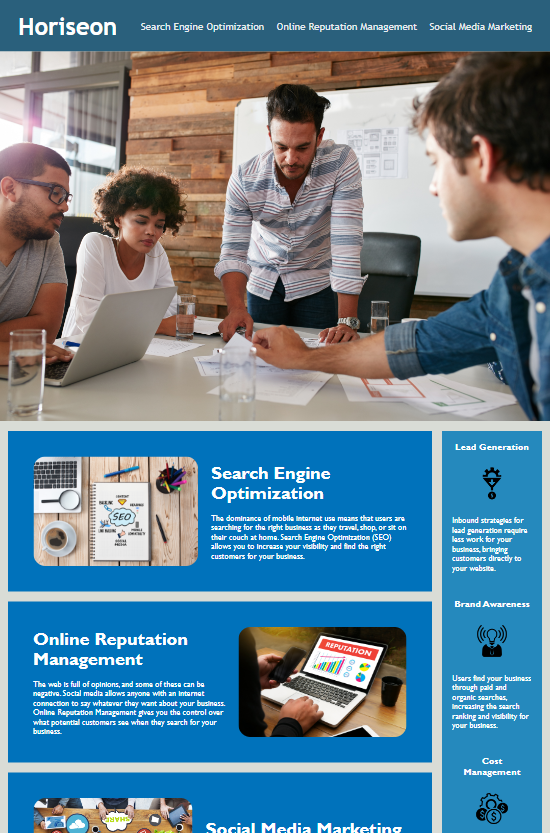
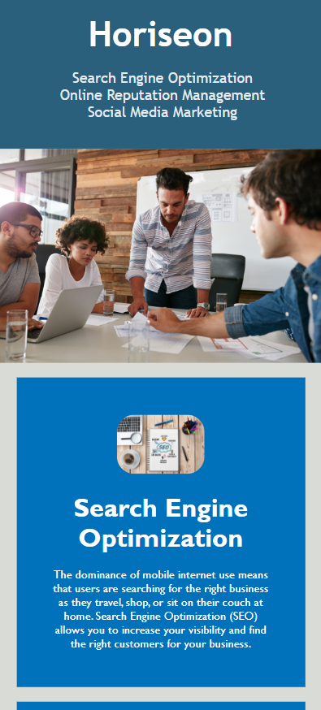

# Module-1-Challenge

## Description
  I had alot of fun with this challenge. I was finding it very annoying to constantly be adjusting the containers using the padding and margins. Then my tutor explained flex to me and I found it much easier to align items and it also added the web responsiveness that we were learning about in Module 2!

## Deployment Link 🔗
[Web Accessibility](https://moonphase13.github.io/Web-accessibility-C1/)
    

## User Story 📘
* AS A marketing agency
* I WANT a codebase that follows accessibility standards
* SO THAT our own site is optimized for search engines
    

## Acceptance Criteria ✅
* GIVEN a webpage meets accessibility standards
* WHEN I view the source code
* THEN I find semantic HTML elements
* WHEN I view the structure of the HTML elements
* THEN I find that the elements follow a logical structure independent of styling and positioning
* WHEN I view the image elements
* THEN I find accessible alt attributes
* WHEN I view the heading attributes
* THEN they fall in sequential order
* WHEN I view the title element
* THEN I find a concise, descriptive title

## Demo Given

    

## Deployment Screenshot Horizontal

    

## Deployment Screenshot Vertical

    

## Deployment Screenshot Mobile

    

## Credits
* UofT FSF bootcamp team for being so helpful
    

## Licence 🔑
* Not sure if we needed one for this challenge but I did it incase
* MIT © moonphase13
